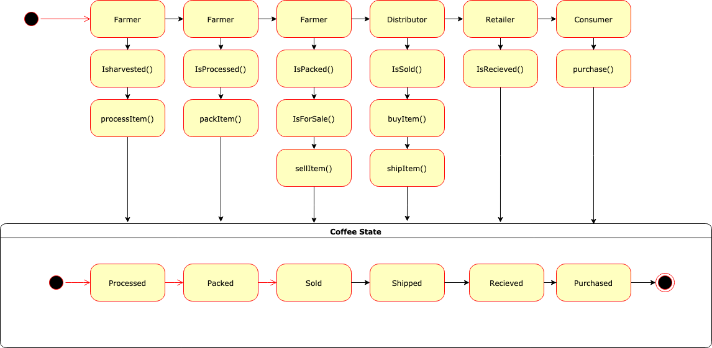

## Coffee Supply Chain Tracing

The project is a blockchain application to trace the proccess on the coffee from the farm to the end user. This is a part of the prereuest for the Nano Degree program of Udacity.

###UML Diagrams
#### Activity Diagram

#### Sequence Diagram

#### State Diagram

#### Data Modelling


### Prerequisites

Please make sure you've already installed ganache-cli, Truffle and enabled MetaMask extension in your browser.


### Installation

A step by step series of examples that tell you have to get a development env running

Clone this repository:

```
$ git clone https://github.com/beratcelik/Supply-Chain-Tracing.git
```

Change directory to ```Project6``` folder and install all requisite npm packages (as listed in ```package.json```):

```
cd Project6
npm install
```
In a separate terminal window, Compile smart contracts:

```
truffle compile
```

This will create the smart contract artifacts in folder ```build\contracts```.

Migrate smart contracts to the locally running blockchain, ganache-cli:

```
truffle migrate
```

Test smart contracts:

```
truffle test
```

All 10 tests should pass.
In a separate terminal window, launch the DApp:

```
npm run dev
```
### Example
A running copy of the smart contract on Rinkeby Test Network can be reached via
```
Transaction ID: 0xc39456b59b3b76302d92f1d4bea2cc487a8b4a69b79663f7fd6ecf43d584cdca
Contract address: 0xacf3225c598b12530c30656850696ef8f8739ef9`
```

### Licence
GNU GENERAL PUBLIC LICENSE
Version 3, 29 June 2007

### Built With

* [Ethereum](https://www.ethereum.org/) - Ethereum is a decentralized platform that runs smart contracts
* [IPFS](https://ipfs.io/) - IPFS is the Distributed Web | A peer-to-peer hypermedia protocol
  to make the web faster, safer, and more open.
* [Truffle Framework](http://truffleframework.com/) - Truffle is the most popular development framework for Ethereum with a mission to make your life a whole lot easier.


### Authors

* Udacity Nano Degree Program
* Dr. Berat Çelik (beratcelik@gmail.com)

### Acknowledgments

* Solidity
* Ganache-cli
* Truffle
* IPFS
